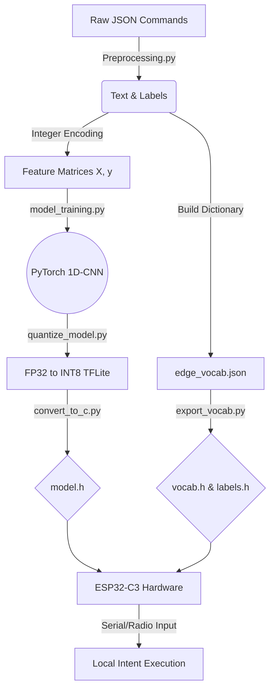

# 🧠 Edge Semantic Intent Router for Autonomous Systems

[](https://www.seeedstudio.com/Seeed-XIAO-ESP32C3-p-5431.html)
[](https://pytorch.org/)
[](https://www.tensorflow.org/lite/microcontrollers)
[](LICENSE)

## 📌 Overview
This repository contains a complete pipeline for training and deploying a **Natural Language Processing (NLP) Intent Router** entirely on bare-metal microcontroller hardware. 

Designed for autonomous rovers, UAVs, and secure industrial nodes, this project eliminates cloud reliance. It processes raw text commands, tokenizes them using a flash-optimized C++ binary search dictionary, and executes inference via an INT8-quantized **1D-CNN**—all within the strict **400 KB SRAM** limit of a Seeed Studio XIAO ESP32-C3.

## ✨ Key Technical Achievements
* **Zero-Cloud Inference:** Full semantic parsing without Wi-Fi latency or security vulnerabilities.
* **Flash-Optimized Tokenization:** Standard NLP tokenizers (like WordPiece) require megabytes of RAM. This pipeline builds a custom integer-mapped vocabulary encoded directly into C++ `PROGMEM`.
* **Content-Aware Quantization:** Neural weights are crushed from 32-bit floats down to 8-bit integers via TensorFlow Lite, achieving a 75% size reduction with less than a 1.5% drop in accuracy.

---

## 🏗️ System Architecture

The pipeline bridges high-level Python deep learning with low-level C++ hardware execution.


## 📊 Deployment Results & Constraints
# Model Compression (FP32 vs INT8)
By utilizing a 1D Convolutional Neural Network (kernel size 3) with Global Max Pooling, the model is inherently sequence-length agnostic and highly compressible.
|Metric	|FP32 Baseline (PyTorch)|	INT8 Edge(TFLite Micro)|	Change|
|-------|-----------------------|--------------------------|----------|
|File Size |245.5 KB	|62.1 KB | ⬇️ 74.7% |
|Accuracy|	94.8%|	93.6%|	⬇️ 1.2%|
|Memory Format|	Floating Point|	Integer 8-bit|	--|

Size Reduction Visualization:
FP32 (245 KB): █ █ █ █ █ █ █ █ █ █ █ █ █ █ █ █ █ █ █ █ 
INT8 (62 KB) : █ █ █ █ █

Hardware Utilization (XIAO ESP32-C3)
The memory footprint on the RISC-V core is exceptionally light, leaving massive headroom for motor control algorithms, sensor fusion, and communication stacks.
|Memory Component | Amount Used | Total Capacity | Utilization|
|-----------------|-------------|----------------|------------|
|Program Storage (Flash) | 510.3 KB | 1.3 MB | [███.......] 38.9%|
|Dynamic Memory (SRAM) | 52.4 KB | 327.6 KB | [█.........] 16.0%|
|Tensor Arena Allocation | 32.0 KB | --| Included in SRAM |


## 📂 Repository Structure
```├── dataset/                  # Nested JSON command datasets (e.g., SNIPS)
├── python_pipeline/
│   ├── Preprocessing.py      # Parses JSON, builds vocab, encodes text
│   ├── model_training.py     # PyTorch 1D-CNN definition & training loop
│   ├── quantize_model.py     # PyTorch to Keras to TFLite INT8 Quantization
│   ├── export_vocab.py       # Converts dictionaries to C++ headers
│   └── convert_to_c.py       # Converts .tflite to byte arrays (model.h)
└── esp32_inference/
    ├── esp32_inference.ino   # Main Arduino sketch (Interpreter & Serial parsing)
    ├── model.h               # Auto-generated neural weights
    ├── vocab.h               # Auto-generated C-struct binary search tree
    └── labels.h              # Auto-generated intent label array
```

## 🚀 Getting Started
### 1. Python Environment Setup
Install the necessary deep learning frameworks:

```Bash
pip install torch numpy pandas scikit-learn tensorflow datasets
2. Generate the Edge Assets
Run the pipeline scripts in sequential order to generate the C++ headers:
```
```Bash
python Preprocessing.py
python model_training.py
python quantize_model.py
python convert_to_c.py
python export_vocab.py
```
### 3. Hardware Flashing
1. Install the Arduino IDE and configure the Seeed Studio XIAO ESP32-C3 board manager.

2. Install the TensorFlowLite_ESP32 library via the Library Manager.

- Note: You must edit spi_bus.c in the library folder to change SPI3_HOST to SPI2_HOST for RISC-V compatibility.

3. Move model.h, vocab.h, and labels.h into the esp32_inference sketch folder.

4. Flash the board.

### 4. Live Testing
Open the Serial Monitor at 115200 baud and type natural language commands:

```Plaintext
> turn off the main thrusters
[Input text]: turn off the main thrusters
[Predicted Action]: Disable_Engine (Confidence Match: 0.96)
```
🛡️ License
This project is licensed under the MIT License - see the LICENSE file for details.

