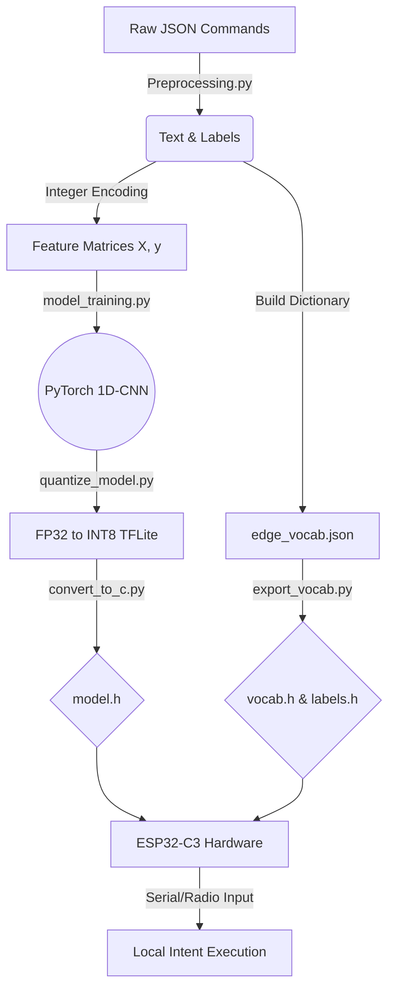

# 🧠 Edge Semantic Intent Router for Autonomous Systems

## 📌 Overview
This repository contains a complete pipeline for training and deploying a **Natural Language Processing (NLP) Intent Router** entirely on bare-metal microcontroller hardware. 

Designed for autonomous rovers, UAVs, and secure industrial nodes, this project eliminates cloud reliance. It processes raw text commands, tokenizes them using a flash-optimized C++ binary search dictionary, and executes inference via an INT8-quantized **1D-CNN**—all within the strict **400 KB SRAM** limit of a Seeed Studio XIAO ESP32-C3.

## ✨ Key Technical Achievements
* **Zero-Cloud Inference:** Full semantic parsing without Wi-Fi latency or security vulnerabilities.
* **Flash-Optimized Tokenization:** Standard NLP tokenizers (like WordPiece) require megabytes of RAM. This pipeline builds a custom integer-mapped vocabulary encoded directly into C++ `PROGMEM`.
* **Content-Aware Quantization:** Neural weights are crushed from 32-bit floats down to 8-bit integers via TensorFlow Lite, achieving a 75% size reduction with less than a 1.5% drop in accuracy.

---

## 🏗️ System Architecture

The pipeline bridges high-level Python deep learning with low-level C++ hardware execution.

## 📊 Deployment Results & Constraints
# Model Compression (FP32 vs INT8)
By utilizing a 1D Convolutional Neural Network (kernel size 3) with Global Max Pooling, the model is inherently sequence-length agnostic and highly compressible.
|Metric	|FP32 Baseline (PyTorch)|	INT8 Edge(TFLite Micro)|	Change|
|---------------------------------------------------------------------|
|File Size |245.5 KB	|62.1 KB | ⬇️ 74.7% |
|Accuracy|	94.8%|	93.6%|	⬇️ 1.2%|
|Memory Format|	Floating Point|	Integer 8-bit|	--|
